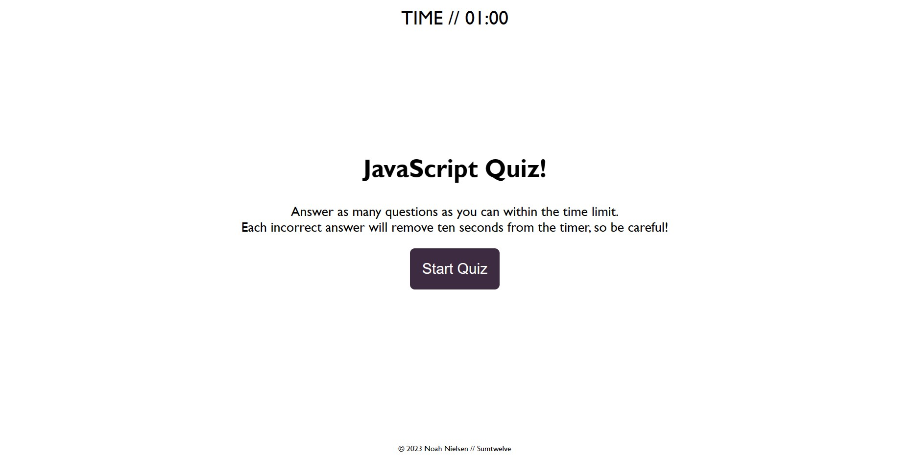
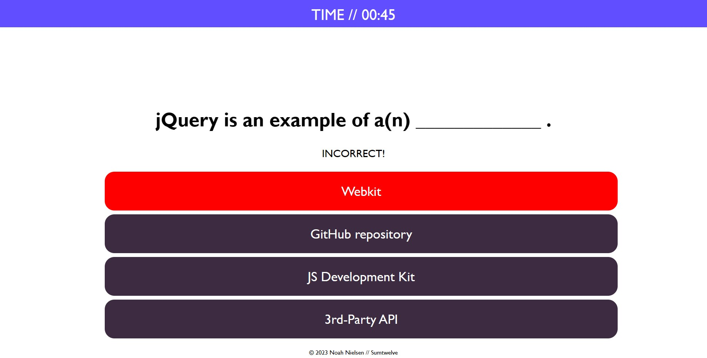

# JavaScript Quiz

## Description
The Week 4 challenge for the University of Utah Coding Bootcamp. A series of questions designed to assess the JavaScript knowledge of the user.

## Usage
Simply visit [https://sumtwelve.github.io/w4-quiz/](https://sumtwelve.github.io/w4-quiz/) and click "Start Quiz" to begin the quiz!

## High Scores
High scores currently use the browser's Local Storage to save data. This means that you will only be competing with yourself, not with users on other browsers or other machines.